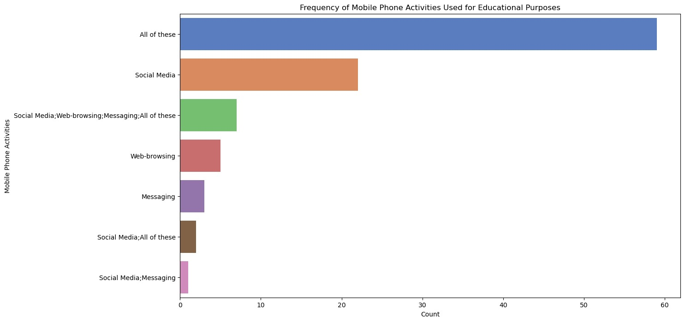
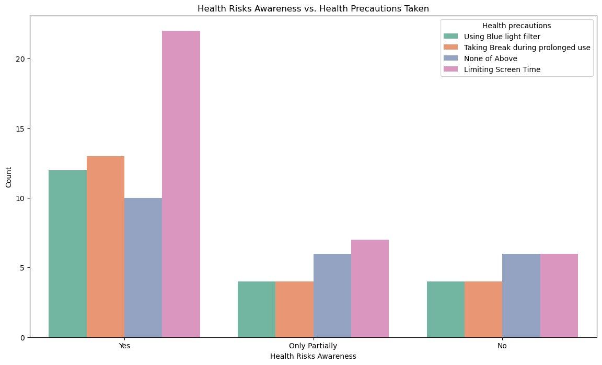
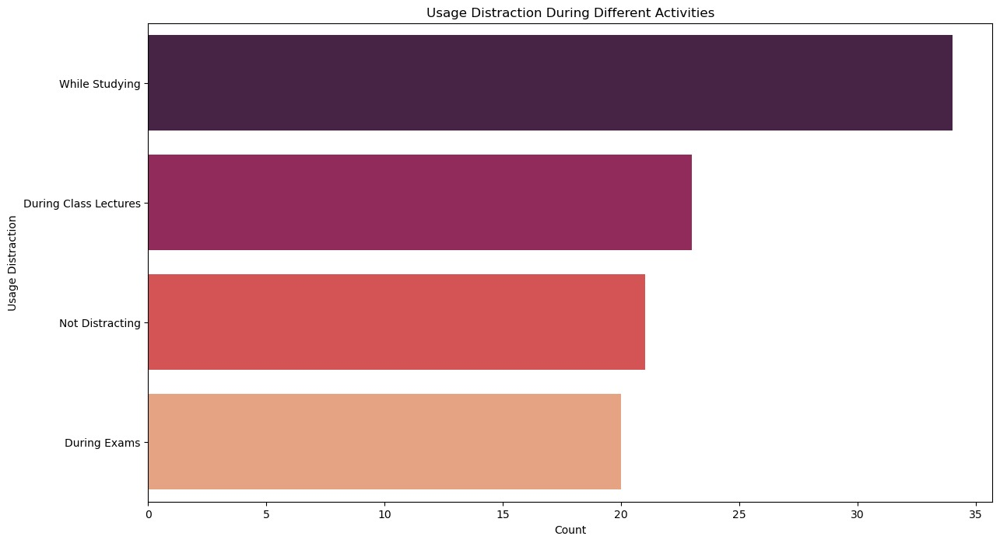

# Analysis of Mobile Phone Usage on Academic Performance

## Team Members
- Goda Kodati
- Ganesh Vasa
- Mohan Vamsi Sajja
- Manohar Reddy Thirumalareddy
- Sri Hari Shankar Reddy Mandapati

## Project Introduction
This project investigates the influence of mobile phone usage on academic performance using a dataset from Kaggle containing details like daily phone usage, academic indicators, and demographic data. The primary objective is predictive, focusing on how mobile phone habits impact academic results and identifying subgroups with varying usage patterns.

A combination of supervised and unsupervised learning techniques will be utilized. K-means clustering will reveal patterns in phone usage and academic performance, while logistic regression will predict the academic impact of mobile phone use. Association rule mining will also be employed to discover frequent patterns and relationships between mobile phone activities and academic outcomes. This integrated approach aims to offer a thorough understanding of how mobile phone usage affects students' academic achievements.

## Research Question
How does mobile phone usage influence academic performance among students, and can distinct patterns of usage be identified that correlate with varying academic outcomes?

This research aims to predict the impact of mobile phone habits on academic success and uncover subgroups of students with different usage behaviors through clustering and association rule mining techniques. By analyzing the dataset, the study will focus on identifying specific usage patterns, such as the frequency and types of educational activities engaged in, and their relationship with academic performance indicators. Understanding these correlations can help educators and students make informed decisions about mobile phone usage, ultimately promoting more effective study habits and improving academic outcomes.

## Relevant Domain Information
1. **[Pattern of Mobile Phone Usage and Its Effects on Psychological Health, Sleep, and Academic Performance in Students of a Medical University](https://www.njppp.com/fulltext/28-1446609222.pdf?1722014169)**
   - *Authors*: Naveenta Gupta, Sonia Garg, Khushdeep Arora
   - *Summary*: This study draws attention to the widespread and detrimental use of mobile phones among medical students. It was found that using a phone excessively and inappropriately—for example, while driving, in class, or late at night—has a negative impact on students' mental well-being, quality of sleep, and academic achievement. The authors stress the significance of talking about these effects and advise using cell phones responsibly to lessen these negative effects.

2. **[Impact of Mobile Phone Usage on the Academic Performance of Students](https://www.pramanaresearch.org/gallery/prj_c_d_29.pdf)**
   - *Author*: Navpreet Kaur
   - *Summary*: This study looks at how college students' academic performance is affected by using mobile phones. According to the report, a sizable portion of students use their phones in class, which distracts them and has a detrimental impact on their academic performance. The results also show that a large number of students have a phone addiction and check their phones frequently throughout the day, which seriously distracts them from their academics. The study concludes that students' use of mobile phones has become a significant source of distraction, which has decreased academic performance and increased reliance on these gadgets.

## Data Source and Description
The dataset "Impact_of_Mobile_Phone_on_Students_Health.csv" investigates how mobile phone usage influences students' health and academic performance. The dataset includes:
- **Demographics**: Student names, ages, and gender
- **Mobile Phone Details**: Ownership, operating system, educational usage, and daily usage time.
- **Academic Impact**: Performance impact, helpfulness for studying, and distraction levels.
- **Health Effects**: Attention span, awareness of health risks, symptoms experienced, and frequency.
- **Usage Features**: Useful phone features, beneficial subjects, and health precautions.
- **Health Rating**: Overall physical and mental health assessment.

We are exclusively using this dataset as provided on the project assignment page without merging any other datasets. This comprehensive data enables a thorough analysis of the relationship between mobile phone use and academic performance.

## Data Understanding and EDA
The below visualizations give useful information about how mobile phone use impacts students academic performance and health. They focus on the most prevalent activities, health risk knowledge and precautions, gender distribution of mobile operating system usage, the relationship between performance impact and symptom frequency, and the circumstances in which mobile phones are most distracting. Understanding these trends can aid in the development of methods to maximize mobile phone use for educational purposes while minimizing negative effects on health and performance.

### 1. Mobie Phone Activities for Educational Purposes
A bar chart showing the frequency of different mobile phone activities used for educational purposes.

### 2. Health Risks Awareness vs. Health Precautions Taken
A grouped bar chart comparing students' awareness of health risks with the precautions they take.

### 3. Usage Distraction During Different Activities
A bar chart showing the count of students distracted by mobile phone usage during various activities.

Further steps of modeling, evaluation and results of this project are in Deliverable2.ipynb file.
